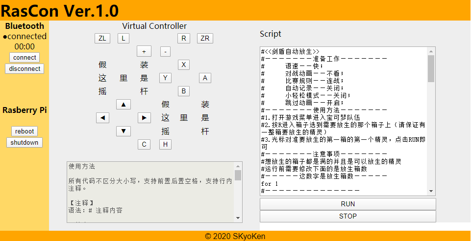

<div align="center">
  <h1>RasCon Ver.1.2</h1>
  <p>Bluetooth経由でNintendo Switchに接続して、Webページからの制御とスクリプト、amiiboの利用を可能にします。。</p>
  <p>オープンソースプロジェクト<a href="https://github.com/mart1nro/joycontrol">joycontrol</a>に基づいて</p>
  <p>
  <a href="https://github.com/SkyoKen/RasCon_NS"></a>
  <a href="https://github.com/SkyoKen/RasCon_NS"></a>
  <a href="https://github.com/SkyoKen/RasCon_NS"></a>
  </p>
  <p>
  <a href="README.md">中文</a> | 
  <a href="README_JP.md">日本語</a> | 
  <a href="README_EN.md">ENGLISH</a>
</p>
</div>

## 画面
<br/>

<br/>

## 環境
* python 3.7.3
* bluetoothd 5.50
* apache2 2.4.38  
* flask 1.0.2 

raspi3b +（rasbian）で正常に実行されます。

## 使用する前に
1.joycontrolプロジェクトのjoycontrolフォルダーをこのプロジェクトディレクトリにコピーする必要があります。
```
sudo git clone https://github.com/SkyoKen/RasCon_NS.git

sudo git clone https://github.com/mart1nro/joycontrol.git

sudo cp -r joycontrol/joycontrol RasCon_NS/
```
2.必要なパッケージ
```
sudo apt install python3-dbus libhidapi-hidraw0 apache2

sudo pip3 install dbus-python flask
```

## 実行
1．ターミナルを開き、コマンドを実行します
```
sudo python3 web.py
```
2．ブラウザを使用して、Raspberry PiのIPアドレス：5000（E.g 192.168.1.100:5000）を開きます

3．[コントローラー]-> [持ちかた順番を変える]をクリックします

4．他のターミナルを開き、コマンドを実行します
```
sudo python3 run.py
```
5．接続後、ウェブページを操作できます

## 参考用スクリプト
https://github.com/SkyoKen/RasCon_NS/releases

## Possible problems

### Q：hci0 device not found
A：hci0が存在するかどうかを確認、`hciconfig`を実行します

（正常に動作しない場合...別のシステムに変更した後に動作する可能性があります。 Raspberry Piがubuntu18.04とubuntu mateでhci0を起動できないことがありました...

## 参考
万恶之源 [Switch-Fightstick](https://github.com/progmem/Switch-Fightstick)

蓝牙模拟ns手柄（可模拟amiibo） [joycontrol](https://github.com/mart1nro/joycontrol)

蓝牙模拟ns手柄实现剑盾自动化 [poke_auto_joy](https://github.com/xxwsL/poke_auto_joy)

小白也能写的自动化脚本 [EasyCon（伊机控）](https://github.com/nukieberry/PokemonTycoon)


